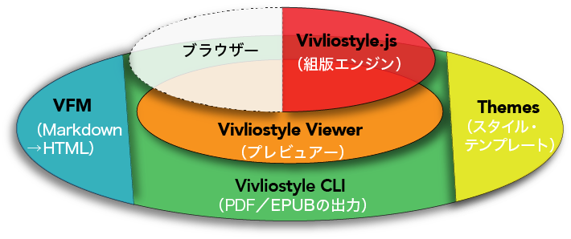
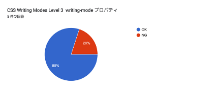
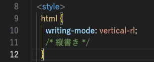
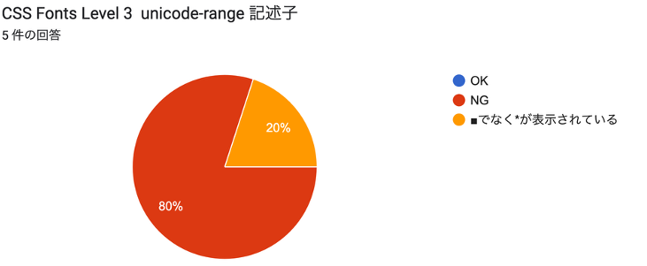

# 
  あの電子書籍リーダーの 表示性能が知りたい! 
   電子書籍『EPUBリーダー表示テスト』活用術

小形克宏（次世代パブリッシング研究会） 
2025年11月25日 
Advanced Publishing Lab.（APL）＋日本電子出版協会（JEPA）共催セミナー 

# 自己紹介

- 小形克宏（おがた　かつひろ）
- 一般社団法人ビブリオスタイル理事
- CSS組版でワンソースから印刷用とEPUBが出力できるライブラリ[「Vivliostyle」](https://vivliostyle.org/ja/)の開発団体
- 代表理事である村上真雄も、CSSテストの制作を担当した
- EPUBリーダーテストの実施者として利益が相反するのは確か
- しかし、GitHubリポジトリやテスト結果を公開することで、客観性の担保に努めた

#   次世代パブリッシング研究会とは？

- 出版・印刷の未来を考える業界内勉強会
- 2000年代、「XMLコンソーシアム／クロスメディアパブリッシング部会」として創設
- 2010年4月、日本印刷技術協会（JAGAT）を拠点とする「XMLパブリッシング（準）研究会」に改名
- 2022年、「JAGAT次世代パブリッシング研究会」に改称
- 2025年4月、現在の名称になる
- 活動内容はメンバー全員で「調べてみる系」と「作ってみる系」
- 一緒に活動する人、大歓迎❗→[Discord招待リンク](https://discord.gg/aXQ7BQSW)

# これまでの経緯❶

- 『EPUBリーダー表示テスト報告書（2023年度）』のはじまり
  - （以下、2003年調査）

# これまでの経緯❷

- 2003年調査でわかったこと
    - EPUBリーダーとレイアウトエンジン
        - モダンブラウザー系と独自エンジン系
        - ブラウザのレイアウトエンジンを使うメリット・デメリット
    - 日本の電子書店の多くは独自エンジン系

# これまでの経緯❸

- JEPAセミナーに登壇（2024年4月24日）
  - [各社のEPUBリーダーは、現行CSS仕様やアクセシビリティをどれだけサポートしているのか？〈日本電子出版協会（2024年4月24日）〉](https://www.jepa.or.jp/sem/20240424/)
- ところが反響はたった2つ……
  1. [週刊出版ニュースまとめ＆コラム #617](https://hon.jp/news/1.0/0/47244#EPUBCSS2024424)
  2. ポット出版、沢辺社長から出版のお誘いが！

# これまでの経緯❹

- [『じょうずなピラニアのつかまえ方』（ポット出版）](https://honto.jp/ebook/pd-series_B-MBJ-21500-120584215-001-001.html)
  - **商品説明**：EPUBリーダでの日本語表示確認のためのEPUBファイルです。このバージョンでは、表示できる文字をチェックするためのページが含まれています。文字コードセットを、JIS X 0213とAdobe Japan1-6のそれぞれで列挙し、表示の確認ができるようになっています。また、縦書時の記号類の回転状況をチェックできるページもあります。

# これまでの経緯❺

- **［確認］**2023年調査の反省点
    - ⓵電子書店は出版社が作ったEPUBをそのまま売る訳ではない
        - 本当のテスト結果は、実際に販売しない限り分からない
        - **→では、実際に電子書店に流通させてみよう！**
    - ⓶テスト結果を見ただけでCSS仕様通りか否か判断できない
        - **→正しい表示のスクリーンショットを紙で出版しよう**

# 『EPUBリーダー表示テスト』の発刊

<figure class="float-right-img">
  
</figure>

- あの電子書店リーダーの表示性能を調べた！
- （デモ）

# 『EPUBリーダー表示テスト正解集』の発刊

{width=30%}

# 『EPUBリーダー表示テスト』を 電子取次に納品した結果

- 結合文字によるリジェクト
    - BookLive!（ἀ <U+1F00>　他）
    - 楽天kobo
- SVG画像によるリジェクト
    - コミックシーモア

# 電子書籍リーダー表示テスト（2025）の実施❶

- [①電子書籍リーダー表示テスト（2025）](https://forms.gle/C6yzzC5ybs8fjbWx6)
- [②電子書籍リーダー表示テスト（2025）](https://forms.gle/Pbdh7PLrPh238mgd7)
- [③電子書籍リーダー表示テスト（2025）](https://forms.gle/YbzHYeAsuNJW7wdUA)
- [④電子書籍リーダー表示テスト（2025）](https://forms.gle/H6cXEwAbYR2PosWG6)
  - 答えやすさを考慮して、テストファイルを4分割。
  - 回答者は回答結果（スプレッドシート）も閲覧可能に設定
  - （デモ）

  # 電子書籍リーダー表示テスト（2025）の実施❷

- 趣旨：このテストは、電子書店・アプリケーション等におけるEPUBリーダーの性能調査を目的に、次世代パブリッシング研究会が実施するテストです。
- 応募資格：『EPUBリーダー表示テスト』（次世代パブリッシング研究会、ポット出版、2025年、110円）を実際に購入した上で、正確に、そして誠実に回答してくださる方なら、どなたでも応募できます（ニックネーム可）。なお、明らかにイタズラあるいは妨害と認められる回答は主催者が削除することを、あらかじめご了承ください。
- 第1回期限：2025年3月31日

  # 電子書籍リーダー表示テスト（2025）の実施❸

- テストの手順
  1. テスト対象の電子書店で前掲『EPUBリーダー表示テスト』を購入する
  2. 当該書籍を表示させる
  3. 表示されたテストの結果を本フォームに記入する
- 参考：テスト内容を解説した書籍、『EPUBリーダー表示テスト正解集』（次世代パブリッシング研究会、2025年、ポット出版、2,300円）を参照するとテストがやり易いでしょう

# このテストで、こんなことが分かる

- 最後に、[①電子書籍リーダー表示テスト（2025）](https://forms.gle/C6yzzC5ybs8fjbWx6)（**CSS仕様適合性テスト**）の具体的な内容について説明
- 今回公開するテストに先行しておこなった、プレビューテストの結果報告
- テスト対象とした電子書店は、我が国で最もシェアが高いKindleストア
- テストに使ったデバイスは、iPhone、Android、Windows、Kindle（第11世代）、Kindle専用端末の5種
  - 時間がなく、Macではテストができなかったことに注意
- ここで報告するテストは①だけで、②④はこの後で発表する田嶋氏、③は仁科氏が説明
- 一人でも多くの人に参加してもらうために、「例えばこんなことが分かる」を説明したい

# Kindle for PC（Windows）で 縦書きができてない？❶

{width=100%}

# Kindle for PC（Windows）で 縦書きができてない？❷

- 左：Kindle for PCでの①電子書籍リーダー表示テスト（2025）のテスト結果
- 右：同じく②におけるテスト結果

# 縦書きがNG、OKだった理由

- 縦書きが効かなかった箇所のスタイル（左）と、効いた箇所のスタイル（右）

- 左は現在の正しい記法
- 右は電書協ガイドのベンダープレフィックス（実装者固有の接頭辞）の記法
  - 電書協ガイドは最近改版したが、新版でもベンダープレフィックスは有効
  - EPUB 3.3（および各種Web標準）では、非推奨（Deprecated）

# アクセシビリティからみたKindle

- 現在の電子書籍リーダーにとって「喫緊の課題」がアクセシビリティ対応のはず
- そこで今回のCSS仕様適合性テストで、5端末全てがNGだったCSSルール（全70）の中から、[“EPUB Accessibility 1.1”](https://www.w3.org/TR/epub-a11y-11/) 及び [“Web Content Accessibility Guidelines (WCAG) 2.2”](https://waic.jp/translations/WCAG22/) への対応のために、とくに必要なルールを4つ紹介します

# `unicode-range` 記述子と`orphans` / `widows` プロパティの未サポート

<figure style="float: left; width: 56%; margin: 0;">
  
  <figcaption>CSS Fonts Level 3 unicode-range 記述子</figcaption>
</figure>

<figure style="float: right; width: 42%; margin: 0;">
  
  <figcaption>CSS Fragmentation Module Level 3 orphans, widows プロパティ</figcaption>
</figure>

### `unicode-range` , `orphans` / `widows`とアクセシビリティ

| CSS要素 | 関連するWCAG達成基準 | EPUB A11Y 1.1における役割 |
| :--- | :--- | :--- |
| **1. `unicode-range` 記述子** | 1.1.1 (非テキストコンテンツ) | **【情報保障】** コンテンツ内の特殊な文字が欠落せず表示されることを保証し、**文字化けを防ぐ**。 |
| **2. `orphans` / `widows` プロパティ** | 1.4.8 (視覚的提示) | **【認知負荷の軽減】** 段落の不自然な分断を防ぐことで、読者の視覚的な追従負担を減らし、**可読性を高める**。 |

# 論理プロパティとCSS変数の未サポート

### 論理プロパティとCSS変数とアクセシビリティ

| CSS要素 | 関連するWCAG達成基準 | EPUB A11Y 1.1における役割 |
| :--- | :--- | :--- |
| **3. 論理プロパティ** (例: `padding-block`) | 1.3.1 (情報及び関係性) | **【構造的適応性】** 物理的指定から論理的指定へ移行することで、**縦書き・横書きのどちらでも一貫した構造**と余白を維持する。 |
| **4. CSS変数** (Custom Properties) | 1.4.3 (コントラスト) / 1.4.8 (視覚的提示) | **【テーマの柔軟性】** ハイコントラストやフォントサイズ調整など、**ユーザーによるテーマの一括切り替え**を容易にし、ユーザースタイルを尊重する。 |

# おしまい。田嶋さんの報告につづきます

