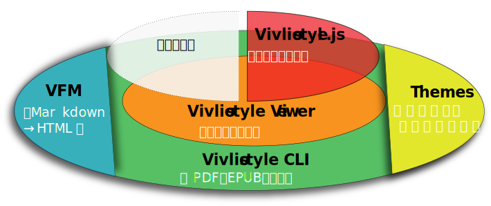
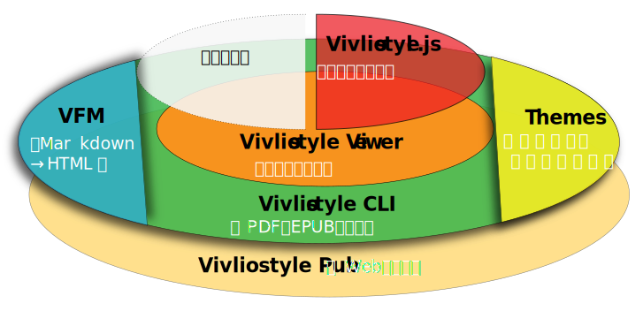
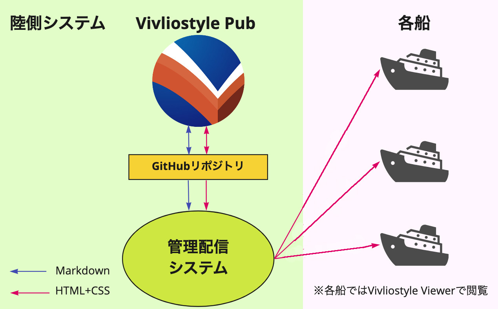

# Web技術によるページ組版とVivliostyle 

小形克宏 
Vivliostyle Foundation 
2025年1月17日 
XML・CSS組版の動向と生成AI活用 

# ※このスライドはVivliostyle CLIで作成し、表示させています

# CSS組版とは？

- HTMLとCSSにより文字・図版・写真などをページ上に配置すること
- ページ組版用CSS仕様を実装することで実現
    - [CSS Paged Media Module Level 3](https://www.w3.org/TR/css-page-3/)
        - ページネーション（ページによる区切り）のサポート
    - [CSS Generated Content for Paged Media Module](https://www.w3.org/TR/css-gcpm-3/)
        - 版面を構成する柱、ノンブル等をサポート
- Vivliostyleはその実装の一つ

# さまざまなCSS組版アプリケーション

- [Antenna House Formatter](https://www.antenna.co.jp/AHF/)
- [BFO Publisher](https://publisher.bfo.com/)
- [DocRaptor](https://docraptor.com/)
- [Paged.js★](https://pagedjs.org/)
- [PDFreactor](https://www.pdfreactor.com/)
- [Prince](https://www.princexml.com/)
- [Typeset.sh](https://typeset.sh/)
- [WeasyPrint★](https://weasyprint.org/)

（★はオープンソース⁠）⁠

# 他と比べたVivliostyleの特徴

- **オープンソースであること**
    - [AGPLライセンス](https://gpl.mhatta.org/agpl.ja.html)
    - 実装を公開する場合は、ソースコードの公開が必要
- **ブラウザーのポリフィルであること**
    - ポリフィル：ブラウザが未実装の機能を追加するコード／ライブラリ
    - ブラウザーと一体になって動作する
    - ブラウザが実装した最新のCSS仕様がVivliostyleでも利用可能に
- **縦書きを始めとする日本語組版に強いこと**
    - CSS仕様の国際化はこの10年で飛躍的に向上
    - 日本語組版の仕様化もかなり進んだ
    - そうしたCSS仕様をVivliostyleは意欲的に実装

# プロダクト①：Vivliostyle Viewer

- 機能：組版エンジンとプレビュー
    - HTMLファイルを読み込み、ページ組版し、プレビューを出力する
- アプリケーションではなくライブラリ
    - 組版エンジンを独立させることで、柔軟な開発が可能に

{width=50%}

# プロダクト②：Vivliostyle CLI

- 機能
    - MarkdownをHTMLに変換すること（VFM）
    - スタイルを切り替えること（Themes）
    - 複数の原稿から本の形にまとめること
    - HTMLとCSSを処理し、ページに組み立てること（Vivliostyle.js）
    - CSS組版の結果をプレビューすること（Vivliostyle Viewer）
    - PDFとEPUBを出力すること

# プロダクト②：Vivliostyle CLI

{width=100%}

# プロダクト②：Vivliostyle Pub

- Vivliostyle CLIをクラウド上に置いたもの
- 加えてユーザー管理などの機構を追加したWebアプリ

{width=82%}

# ユースケース①：同人誌の制作

- VivlioStyleとRehype/RemarkではじめるCSS組版による同人誌制作（げぐはつ書房）
    - ギフトリンク https://booth.pm/gifts/efc1bd78-75f4-4b22-85d8-434183b7d8b5 （pixivアカウント必要）

{width=22%}

# 商業出版での単行本制作（リブロワークス）

- https://libroworks.co.jp/?tag=vivliostyle
- [Web技術で「本」が作れるCSS組版Vivliostyle入門](https://amzn.asia/d/ik2K1Ob)
- [Juliaではじめる数値計算入門](https://amzn.asia/d/4ZVM4Ys)

# 電子書店のビューワ（シンクロナス）

- [歴史ノ部屋（乃至政彦）](https://www.synchronous.jp/ud/content/613ae89077656127a1000000)

# 電子書籍の校正（三陽社）

- [EPUB ファイルから Vivliostyle で PDF を作りたい！](https://vivliostyle.org/viewer/#src=https://vivliostyle.github.io/vivliostyle_doc/ja/vivliostyle-user-group-vol2/index.html&bookMode=true&f=epubcfi(/10!))

# 複数の船舶との文書共有（ファーストマリンサービス株式会社）

- [fmspub-test](https://github.com/MurakamiShinyu/fmspub-test)
- [Vivliostyle Pub](https://vivliostyle-pub-develop.vercel.app/github/MurakamiShinyu/fmspub-test?branch=main)

{width=50%}

# Vivliostyleの課題と未来

- Webアプリのメリットはインストールなしに**誰でも手軽に**使えること
- ところが現状のVivliostyle PubはCSSの知識がないと本が作れない
- **CSSを知らなくても使える**ようVivliostyle Pubのアップデートに着手
- どうかご期待ください！